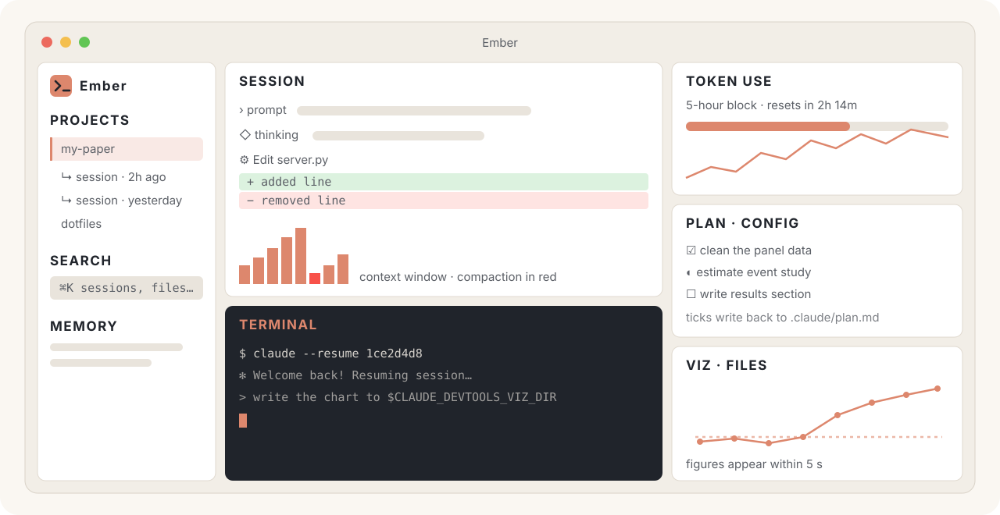

<p align="center">
  
</p>

<p align="center">
  <a href="https://github.com/PierreBeaucoral/ember/actions/workflows/ci.yml"></a>
  
  
  
  
  <a href="LICENSE"></a>
</p>

<p align="center">
  <b>Your Claude Code sessions, a real terminal, your plan and your token budget: one local window.</b><br>
  <sub>Formerly <code>claude-devtools-lite</code>. Same repo, new name; old links redirect.</sub>
</p>

<p align="center">
  <a href="#install-and-run">Install</a> ·
  <a href="#features">Features</a> ·
  <a href="#optional-add-ons">Add-ons</a> ·
  <a href="#usage">Usage</a> ·
  <a href="#security">Security</a>
</p>

---

Ember is a local dashboard for **Claude Code** sessions (timelines, thinking blocks,
tool calls, diffs, token usage, subagents, memory) with an **embedded terminal**,
a **live plan checklist**, a **file explorer** and a **visual output pane**, laid out
like RStudio.

It reads your transcripts **read-only** and runs entirely on your machine.
**No dependencies, no build step, no API keys, no telemetry.** It is one Python file,
one HTML file and the Python standard library, and it runs on **macOS, Linux and Windows**.

```bash
git clone https://github.com/PierreBeaucoral/ember.git && cd ember && python3 server.py
```

<p align="center">
  
</p>

Every pane can be **maximized (⛶)** or **resized by dragging** the splitters, and the layout
is saved between sessions. The coral accent marks navigation, focus and activity; diff,
warning and success colors keep their own meanings. **Ember Dark** and **Ember Light**
join the eight classic editor themes.

| | |
|---|---|
| 🔍 **See what really happened** | Every prompt, thinking block, tool call and diff, plus context-window compaction |
| ⌨️ **Jump back in** | `claude --resume` any session in an embedded PTY terminal, up to 6 tabs |
| ✅ **Shared plan** | `.claude/plan.md` as a live checklist that you and Claude both tick |
| 📊 **Know your budget** | 5-hour block, 7-day usage, P90 limit estimate, per-model breakdown |
| 🧩 **Know your context tax** | What every agent, skill, rule and MCP server in `~/.claude` costs per turn |
| 🖼️ **See the output** | Figures Claude writes to `$CLAUDE_DEVTOOLS_VIZ_DIR` render within 5 s |

## Why

Claude Code writes a rich JSONL transcript for every session, but the CLI shows you a
condensed view of it. This reconstructs what actually happened: which files were read,
what each tool returned, what the model was thinking, how the context window filled up
and compacted, how many tokens each session burned — and lets you jump straight back
into any session in an embedded terminal.

## Features

**Session inspection**
- Every project and session under `~/.claude/projects/`, with real working-directory
  paths (decoded from the transcripts, not the lossy folder slugs)
- Full timeline: user prompts, assistant messages (rendered markdown), collapsible
  **thinking** blocks, and every **tool call** paired with its result
- **LaTeX renders as math** — `$$…$$`, `\[…\]`, `\(…\)` and `$…$` are typeset with
  KaTeX, so derivations and estimators read like a paper, not like source. Prices
  (`$5`) and shell variables (`$HOME`) are left alone
- **Markdown tables render as tables**, including the ragged ones Claude often emits
  (a `|---|---|` line shorter than its own header); math inside cells is typeset too
- **Subagents appear where they were launched**: each `Task` call carries an expandable
  card showing the agent type, its task, whether it failed, and what it cost — entries,
  tool calls, output tokens, peak context, wall time. Expanding nests the agent's
  transcript inline, fetched on demand, so you keep your place in the parent session
- **Real diffs** for `Edit`/`Write` calls, rendered from the recorded patch hunks
- **Context-window chart**: one bar per API request, with automatic **compaction
  detection** (red bars where the context dropped sharply)
- Token totals per session, deduplicated by request ID, plus a tool-call histogram
- **Subagent transcripts** open in the same viewer, and the header chips are named by
  agent type rather than uuid
- **The sidebar filters as you type** (project paths, and session titles in opened
  projects); **Enter** runs the full-text search — in the open project first (fast), with
  one click to widen to every project — and it covers **subagent transcripts** too.
  Results jump to the matching entry. Esc clears the filter
- **Live-follow**: a session that is still being written updates in place every few
  seconds (● live), scrolling with it only if you were at the bottom
- Reopening a session is instant: the parsed transcript is cached until the file changes
- Project **memory** files rendered in place
- Big transcripts (20 MB+, thousands of entries) load lazily and stay responsive

**Token usage**
- Current 5-hour block with reset countdown, output tokens today and over 7 days,
  an hourly sparkline, and a by-model breakdown
- **Official limits**, with the optional *Live limits* add-on: Claude Code's own 5-hour
  and 7-day usage %, their reset times, and the session's context % and cost, taken from
  the data Claude Code hands its statusline (your existing statusline keeps working)
- Without it, a limit bar compares the current block with the **P90 of your own
  historical blocks** (the [Claude-Code-Usage-Monitor](https://github.com/Maciek-roboblog/Claude-Code-Usage-Monitor)
  approach) — a measured estimate, not an official limit

**Embedded terminal**
- Real PTY streamed to [xterm.js](https://xtermjs.org/): full TUI, colors, resizing
- Launch `claude` in any project's directory, or **resume any session** you're viewing
  (`claude --resume <id>`) with one click
- Up to 6 tabs. Quitting closes sessions **gracefully** (SIGHUP on POSIX,
  `CTRL_CLOSE_EVENT` on Windows) so Claude Code's `SessionEnd` hooks run before exit
- Terminal tabs **survive a page reload**: the page re-attaches to running shells and
  replays their scrollback
- On macOS/Linux, terminal writes stop after 2 seconds if the child is not accepting
  input. Failed input pauses typing and discards queued keystrokes; check for partially
  delivered text before choosing **Resume typing**. Unanswered input requests time out
  in the interface after 10 seconds. Discarded text is never replayed automatically.
- Text is kept readable in every theme, including Claude Code's own truecolor diff
  output on light backgrounds
- With the optional *Live activity* add-on, the sidebar shows what each session is
  doing right now, and a toast tells you when a session **waits for your permission**
- Terminals export `CLAUDE_DEVTOOLS_UI=1`, `CLAUDE_DEVTOOLS_VIZ_DIR`, and
  `CLAUDE_DEVTOOLS_URL`, so a session can tell it's running inside the dashboard

**Keyboard and navigation**
- **⌘K command palette** (Ctrl+K off macOS): actions, `@` sessions, `#` full-text search,
  `/` files, `>` commands. ⌘P jumps to a session; `?` lists every shortcut
- Everything is reachable without a mouse: the project tree (arrow keys), tool and
  thinking blocks, plan tasks, tabs, menus and the splitters (arrow keys resize them);
  Ctrl+1–5 focus a pane, ⌘⇧M maximizes it
- A **status bar** shows the connection, project, terminal, plan progress and 5-hour
  usage at a glance; each segment jumps to its pane
- All ten themes meet WCAG AA contrast; notifications are announced to screen readers

**Plan pane**
- A third right-hand quadrant showing the project's plan as a **live checklist**.
  It reads the first plan file it finds: `.claude/plan.md`, then the newest
  `quality_reports/plans/*.md`, then `PLAN.md` / `TODO.md` / `TASKS.md` / `ROADMAP.md`
- **Ticking a box rewrites the marker in the file** — so the plan is a shared artefact:
  Claude Code writes it, you tick it, the next session reads the ticks back. `[~]` and
  `[/]` render as *in progress*
- Follows the selected project **and the active terminal tab**, so switching consoles
  switches plans; re-reads the file every few seconds, so edits Claude makes show up live
- A file picker appears when a project has several plans; **＋ create** scaffolds
  `.claude/plan.md` when it has none

**Config inventory (⚙ Config tab)**
- What is actually installed in `~/.claude` — agents, skills, commands, rules, hooks,
  plugins, MCP servers — with the project's own `.claude/` alongside it when it has one
- Splits **resident** from **on demand**: `CLAUDE.md` and `rules/` (subfolders included,
  as Claude Code loads them) are pasted into every
  request, and so is one description line per agent/skill/command — their bodies are not.
  So a 45 kB command is nearly free until you invoke it, while a 10 kB rules file is a tax
  on every turn. The pane totals both and sorts each group heaviest-first
- **Flags hooks nothing points at**: files sitting in `~/.claude/hooks/` that no
  `settings.json` event references show in amber, and hooks registered from outside that
  folder still get a row
- **MCP servers are found where Claude Code actually keeps them** — `~/.claude.json`, both
  the global list and the per-project one — not `settings.json`, which usually has none
- Metadata only — never file contents, and never MCP server args or env, which routinely
  hold API keys (there is a test asserting this). Token figures are estimated at ~4 bytes each: rank with them, don't budget
- Click any row to open the file in the Files preview

**End-of-session retrospective**
- When a Claude terminal closes — including when you quit the app — the dashboard can
  run [`/improve`](https://github.com/TerenceBristol/claude-improve) over the transcript
  that just ended and drop a dated report in `~/.claude/improve-reports/<project>/`
- **Read-only by construction** (`--allowedTools Read Grep Glob`) and explicitly told to
  propose rather than apply, so it never edits your `CLAUDE.md` behind your back
- Rate-limited to one run per project per 3 hours, skipped for sessions under 20 KB, and
  guarded against recursing into its own session
- The newest report opens from the **🔎** button in the plan pane. Turn the whole thing
  off with `CDL_IMPROVE=0` in the environment
- Needs the command installed once:
  `mkdir -p ~/.claude/commands && curl -o ~/.claude/commands/improve.md https://raw.githubusercontent.com/TerenceBristol/claude-improve/main/improve.md`

**Viz inbox and file explorer**
- A watched folder: any `.html`, `.png`, `.svg`, `.md`, `.pdf`, `.csv` written there
  appears within 5 seconds and renders automatically. Tell a running Claude session
  *"write the chart to $CLAUDE_DEVTOOLS_VIZ_DIR"* and watch it appear.
- Interrupted folder scans are retried once, with one scan in flight per page.
  Persistent failures show a warning while keeping the last preview visible; the
  warning clears after a successful refresh.
- Projects with a [graphify](https://github.com/anthropics/skills) knowledge graph
  (`graphify-out/graph.html`) display it automatically; projects without one are asked
  whether to build one (**Build graph** launches the skill), and **Don't ask again for
  this folder** silences the prompt for that project
- Images preview scaled to fit the pane (click to expand them full-size)
- A Files pane that follows the selected project, previews files, copies paths, opens a
  shell in any folder, or points the viz watcher at it
- It also follows the **active terminal tab**: switch between two Claude sessions and
  the explorer jumps to that session's project root — or back to wherever you had
  browsed to in it
- **Click a preview to expand it**: the pane goes full-screen (Esc, or ⛶, restores it),
  which is where a knowledge graph or a wide figure is actually usable

**Figure comments** (after [exhibit-review](https://github.com/paulgp/exhibit-review))
- On any image in the Viz pane, **💬 Comment** opens it full-size: click a spot or drag a
  box, then write what should change. Marks are numbered, and each comment is *open*,
  *resolved* or *wontfix*
- Comments save automatically to `.review/<figure>.json` next to the figure, with
  coordinates as fractions of the image (so they survive a re-render at another size) and
  the image's sha256. The figure itself is never written
- **Send to Claude** types a prompt into the active Claude tab (you press Enter), or starts
  a session in the project: find the script behind the figure, apply the open comments,
  re-render, mark them resolved in the JSON
- When the image changes after comments were saved, a **figure regenerated** badge warns
  that old marks may no longer line up. Saves refuse to overwrite a newer revision (for
  example one Claude just wrote)

**Themes**
- **◐** in the sidebar switches the whole app, terminal included: Ember Dark (default),
  Ember Light, GitHub Dark / Light, Solarized Dark / Light, Dracula, Monokai, Tomorrow Night, Cobalt — the
  editor themes RStudio users know. The choice is remembered per browser
- Claude Code picks its own colours: with a light theme here, run `/theme light` there

## Optional add-ons

The dashboard runs on its own, but two features use Claude Code add-ons:
**graphify** (knowledge graphs in the Viz pane) and **/improve** (the end-of-session
retrospective). The **🧩** button opens a pane that shows which add-ons from
[`addons.json`](addons.json) are installed, with a tickbox for each missing one.
It also opens by itself at launch while something is missing; tick
**Don't show at launch** to stop that until the list of missing add-ons changes.

- Two add-ons ship inside this repo (`tools/devtools_hooks.py`, stdlib only):
  **Live limits** wraps your statusline to record Claude Code's official usage figures,
  and **Live activity** adds an async hook that records event *metadata* (event, tool
  name, session — never tool inputs or outputs). Both edit `~/.claude/settings.json`,
  save a copy first as `settings.json.bak-devtools`, and undo with
  `python3 tools/devtools_hooks.py uninstall-statusline` / `uninstall-events`
- Ticked add-ons install in a **visible terminal tab**, with the exact commands shown
  in the pane first. Nothing installs without that click
- **Ticking an installed add-on reinstalls it cleanly** (plugin uninstalled and
  reinstalled, skill folder re-cloned, `uv tool install --force` for graphify) — the fix
  when an install was interrupted, e.g. by closing the app mid-way
- ponytail and codex need **Node.js**: their hooks run `node` on every prompt, so without
  it Claude shows a "UserPromptSubmit hook error" (typical on a fresh Windows PC)
- **Prerequisites are part of the install.** When an add-on needs a program you don't
  have (Node.js, uv, Git, the Codex CLI…), its row says "Also installs: …" with the command
  for *your* OS (Homebrew or the official script on macOS, apt on Debian/Ubuntu, winget
  on Windows — or, on a PC without winget, the program's official installer downloaded
  with PowerShell), and Install runs it first. A freshly installed program usually isn't on
  PATH in the same window, so the installer works in rounds: prerequisites, then — once
  the app actually sees them — the add-ons, in a fresh terminal. winget, brew and sudo
  may ask a question in that terminal; answer it there
- Only when there is no automatic route for your OS does a row say what to install and
  link to it, and can't be ticked
- Statuses refresh on their own while the pane is open. Claude sessions already running
  don't pick up a new skill or plugin: start a new session afterwards
- graphify reads the whole project folder. On a big data folder (or Dropbox online-only
  files) the first step can take minutes: list data folders in a `.graphifyignore`
  (same syntax as `.gitignore`), or run `/graphify <code-subfolder>`
- The list also suggests ponytail, frontend-design, codex, crossref and dream, which the
  dashboard doesn't use. Edit `addons.json` to change what it offers. The app only ever
  runs commands written in that file
- Without `/improve` installed, the retrospective simply doesn't run; without graphify,
  the graph prompt offers to set it up instead of launching an unknown command

## Install and run

Requires **Python 3.9+** and an existing Claude Code installation (`~/.claude`).

```bash
git clone https://github.com/PierreBeaucoral/ember.git
cd ember
python3 server.py
```

In a second terminal, get a login link and open it:

```bash
python3 server.py --launch-url      # prints http://127.0.0.1:3456/launch?c=… (single use, 60 s)
```

On Windows, type `python` instead of `python3` (`python3` there is often the
Microsoft Store stub). The server keeps running until Ctrl+C; opening
`http://127.0.0.1:3456/` without a login link shows a lock screen.

That's the whole setup — but each platform also has a double-click launcher that does
this for you:

### macOS

```bash
bash packaging/macos/build-app.sh
```

Builds `Ember.app` — a native window (WebKit wrapper, no Electron)
with a Dock icon and ⌘Q. Drag it to `/Applications`. It starts the server if needed and
never spawns a duplicate.

### Linux

```bash
launchers/linux/install.sh
```

Adds "Ember" to your application menu (per-user, no `sudo`). Opens an app-mode
browser window (Chrome/Chromium/Brave/Edge) or your default browser. Full feature parity
with macOS.

### Windows

```powershell
powershell -ExecutionPolicy Bypass -File launchers\windows\install.ps1
```

Creates Desktop and Start-menu shortcuts with the app's own icon
(`launchers\windows\claude-devtools.ico`; re-run the script to refresh existing
shortcuts), or double-click
`launchers\windows\Ember.cmd`. The old `Claude DevTools.cmd` still forwards to Ember.

The embedded terminal works on **Windows 10 1809+** through ConPTY, driven via `ctypes`
— still no third-party packages. Verify it on your machine:

```
python tools\selftest_windows.py
```

On older Windows builds the server detects the missing API, explains it in the terminal
pane, and everything else keeps working.

### Updating from Claude DevTools

Rebuild the macOS app or rerun your platform's installer to refresh its name and icon.
On macOS, use the newly built `Ember.app` in place of `Claude DevTools.app`; the build
does not remove your old app. Windows installation replaces this checkout's old
shortcuts; Linux updates the existing desktop entry.

Saved themes are preserved. Choose **◐ → Ember Dark** or **Ember Light** to adopt the
new palette. Existing data directories, authentication, browser preferences and
`CLAUDE_DEVTOOLS_*` environment variables keep their original identifiers for
compatibility; no session migration is needed.

The repository moved from `claude-devtools-lite` to `ember`, and GitHub redirects the
old URL. To point an existing clone at the new name:

```bash
git remote set-url origin https://github.com/PierreBeaucoral/ember.git
```

You don't need to rename the folder: the launchers look for `ember/` first and then
fall back to `claude-devtools-lite/`.

## Usage

| Action | How |
|---|---|
| Browse a project | Click it in the sidebar; sessions expand underneath |
| Inspect a session | Click a session — timeline, chart, and token totals load |
| Hide noise | Toggle **thinking** / **tool calls** / **system** above the timeline |
| Filter the sidebar | Type in the search box — the tree narrows as you type |
| Search everything | Type in the search box, press Enter, click a result to jump to it |
| Open the CLI in a project | Hover a project → **⌨** |
| Start a session anywhere | **+ claude** → pick a project, `~`, or **browse…** for any folder |
| Resume a session | Open it → **⌨ resume in CLI** |
| Show a figure from a session | Have it write into `$CLAUDE_DEVTOOLS_VIZ_DIR` |
| Comment on a figure | Show it in the Viz pane → **💬 Comment** → click or drag, type, **Send to Claude** |
| Change the theme | **◐** in the sidebar |
| Tick off a plan step | Click it in the **PLAN** pane — the markdown file is updated |
| Point the plan pane elsewhere | Use its file picker, or **＋ create `.claude/plan.md`** |
| Read the last retrospective | **🔎** in the PLAN pane header |
| See what's loaded into every turn | **⚙ Config** tab in the PLAN pane |
| Expand a preview | Click the preview itself (Esc restores) |
| Maximize a pane | **⛶** in its header (click again to restore) |
| Resize panes | Drag the splitters; sizes persist |
| Quit | **⏻** in the sidebar (or ⌘Q in the macOS app) |

Green dots mark projects whose transcripts changed since you last opened them, and a
toast appears when a background session finishes something.

### Making Claude aware of the dashboard

Add this to your `~/.claude/CLAUDE.md` so sessions launched from the terminal pane push
their visual output to the viz inbox on their own:

```markdown
## Ember UI awareness

When `CLAUDE_DEVTOOLS_UI=1` is set, this session runs inside the Ember
dashboard. To show the user a visual output (figure, chart, HTML report), also write a
self-contained file into `$CLAUDE_DEVTOOLS_VIZ_DIR` — it renders automatically in the
Viz pane. Prefer inline-only `.html`, `.png`, or `.svg`, with descriptive filenames.

Keep the working plan in `.claude/plan.md` as markdown checkboxes (`- [ ] step`). The
dashboard's PLAN pane renders it and writes ticks back into it, so re-read it before
planning and update it as steps complete.

Figure feedback lives in `.review/<figure>.json` next to a figure (coordinates are
fractions of the image, origin top-left). Before regenerating a figure, read its open
comments; after applying one, set its `status` to `"resolved"` in that file.
```

## Security

The dashboard can spawn shells, so it is built to be safe on a shared machine:

- Binds to **127.0.0.1** only. It **never modifies your transcripts, settings or
  memory**. It writes in exactly three places: its own state file, the plan checkbox you
  click (see below), and `~/.claude/improve-reports/` when a retrospective runs
- **Plan writes are narrow**: only a file the pane discovered for the open project, only
  the `[ ]` / `[x]` marker on one line, and only when the line's text still matches what
  the UI displayed — a stale click is refused rather than applied to the wrong task
- Every `/api` route requires a **token** (generated once, stored `0600` in your OS's
  app-data directory, outside this repo). The launchers trade it for a **one-time, 60 s
  login code** and hand the browser only that code, which becomes a same-site cookie — the
  token never appears in a URL, a browser's command line or the server log. Before sending
  the token, the launcher checks (HMAC challenge) that the server on the port really holds it
- The page runs under a strict **Content-Security-Policy**: scripts only from `/vendor` and
  the one inline script, pinned by its SHA-256, so injected markup cannot execute
- **CSRF guard** (JSON content type + origin allowlist) and a **Host allowlist**
  (DNS-rebinding protection)
- File browsing is confined to `$HOME`, blocks path traversal and symlink escapes, and
  **refuses credential-shaped files** (`.env*`, `*secret*`, `*token*`, `id_rsa`,
  `*.pem`, `.netrc`, `hosts.yml`, …)
- HTML previews render in a **sandboxed iframe** with an opaque origin, and the server
  also sends them with a `sandbox` CSP, so a previewed file cannot reach the dashboard's
  API or your token even when opened directly

**Do not run this with `--host 0.0.0.0`.** That would offer a shell to your network; the
server prints a warning if you try.

## Development

The canonical icon geometry and colors live in `packaging/macos/make_icon.py`.
After editing the mark, run `python3 packaging/macos/make_icon.py --sync` (requires
Pillow) to regenerate the Linux SVG, Windows ICO, favicon, and in-app mark together.
The macOS builder uses the same generator for its ICNS. The shipped assets need no
extra runtime dependencies. Legacy platform asset filenames are intentional.

```bash
python3 -m pytest tests/ -q      # server suite (also run by CI on macOS, Linux, Windows)
```

They cover the transcript-parsing invariants (usage dedup by request ID, tool pairing,
patch rendering, sidechains, compaction detection), 5-hour block grouping, path-safety
guards, the secret deny-list, the HTTP auth/CSRF/Host layer, and the Windows backend
helpers.

| File | Role |
|---|---|
| `server.py` | HTTP server, JSONL parsing, usage aggregation, PTY terminals |
| `winconpty.py` | Windows ConPTY transport (ctypes, no dependencies) |
| `index.html` | Single-page UI (vanilla JS, no framework) |
| `native/main.swift` | macOS standalone window (WebKit) |
| `launchers/`, `packaging/` | Per-platform launchers and app builders |
| `vendor/` | xterm.js 5.5.0 + fit addon and KaTeX 0.16.11 with its woff2 fonts (both MIT), vendored for offline use |
| `tests/` | `pytest tests/` for the server; `node tests/test_frontend.js` for the UI |

## Prior art

Inspired by [claude-devtools](https://github.com/matt1398/claude-devtools) (Electron, far
more featureful) and [Claude-Code-Usage-Monitor](https://github.com/Maciek-roboblog/Claude-Code-Usage-Monitor)
(the P90 usage-baseline idea). This one is deliberately tiny: two main files, standard
library only, hackable in an afternoon.

## Support

If this tool saves you time, you can [buy me a coffee via PayPal](https://www.paypal.me/pb63000).
Entirely optional — bug reports and pull requests are just as welcome.

## License

MIT — see [LICENSE](LICENSE). Bundles [xterm.js](https://github.com/xtermjs/xterm.js)
(MIT) and [KaTeX](https://github.com/KaTeX/KaTeX) (MIT). Not affiliated with Anthropic.
